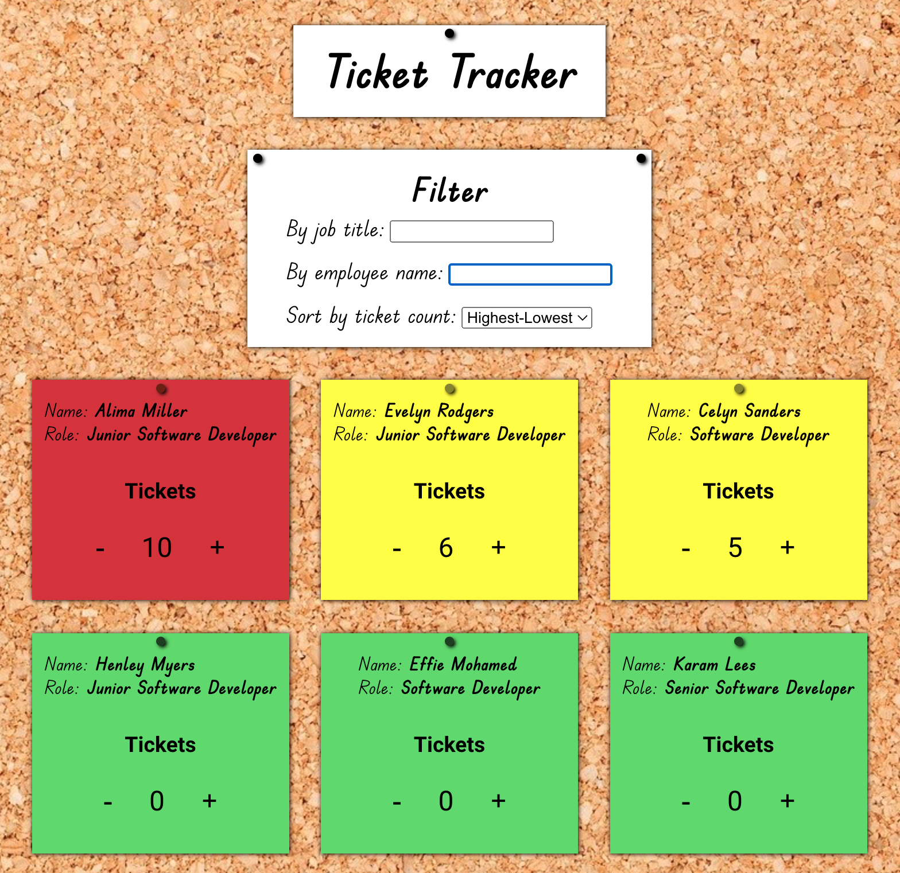

Ticket tracking system which employees can use to increment/decrement their ticket count. Can filter by job title or name and sort by ticket count. Employee cards change colour based on the number of tickets they have.

Built in React with useState. SCSS used for styling and BEM naming convention used for class names.

Screenshot:

